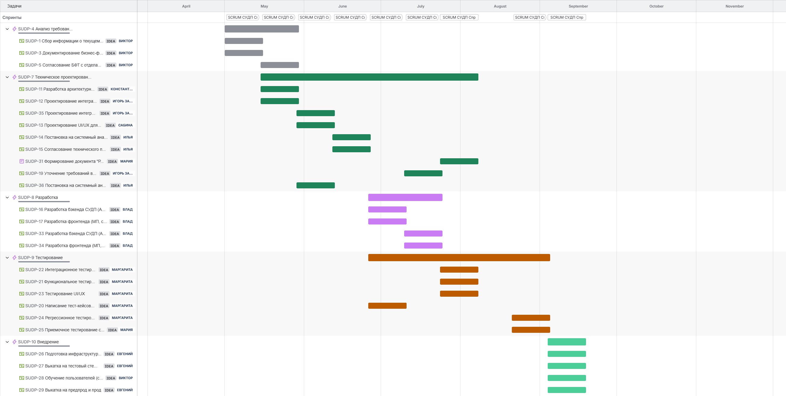
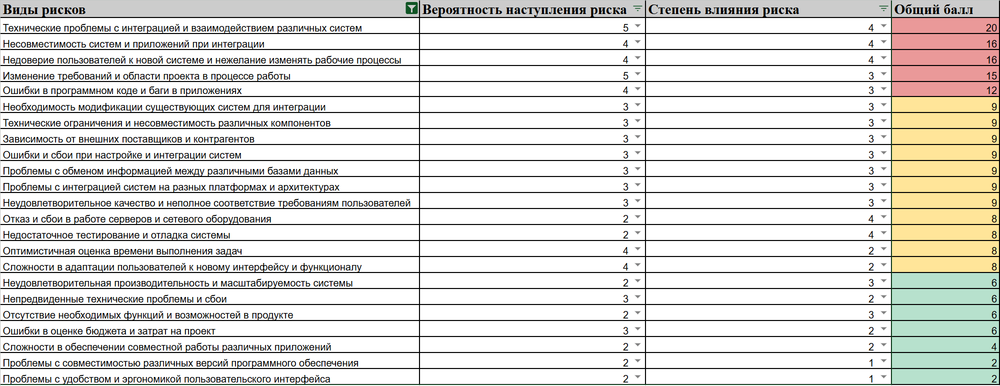
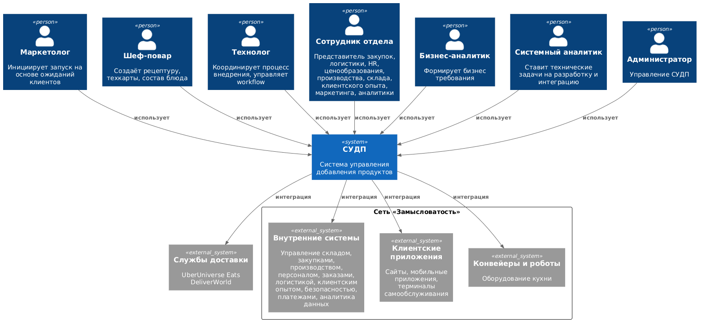
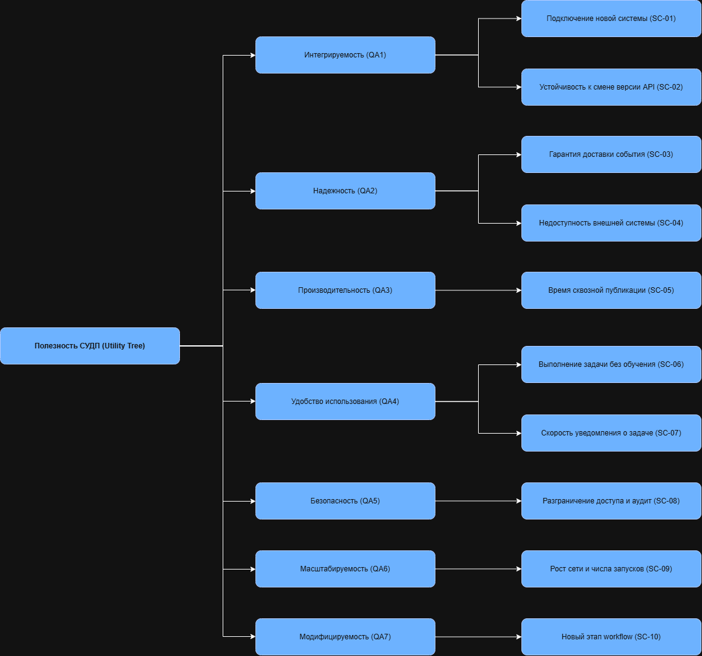
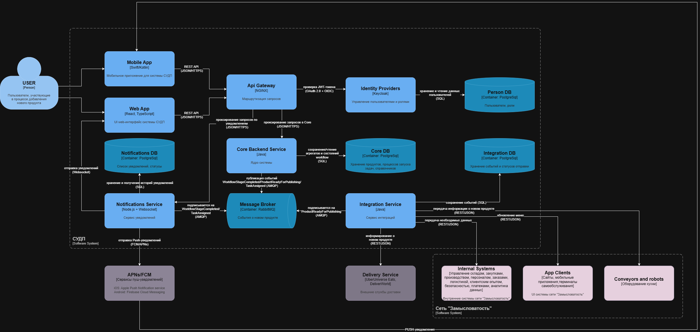
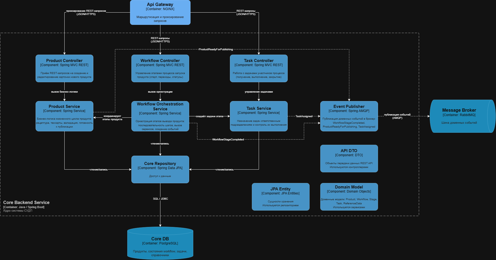
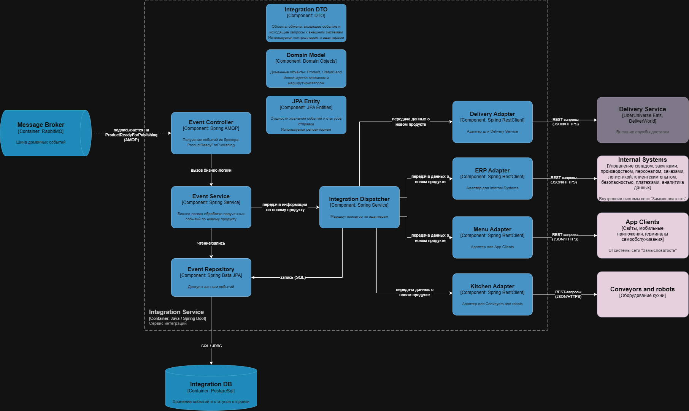
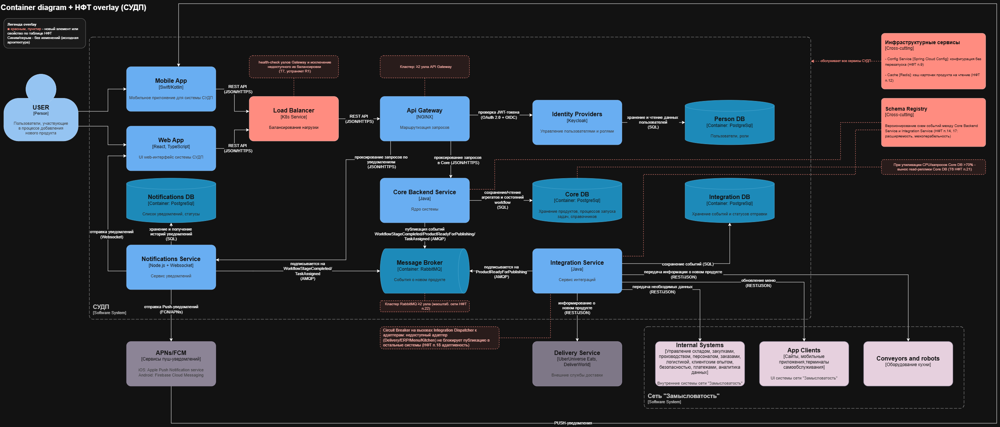
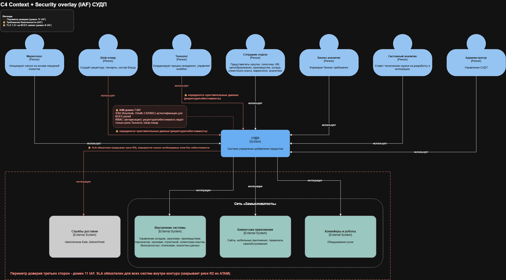
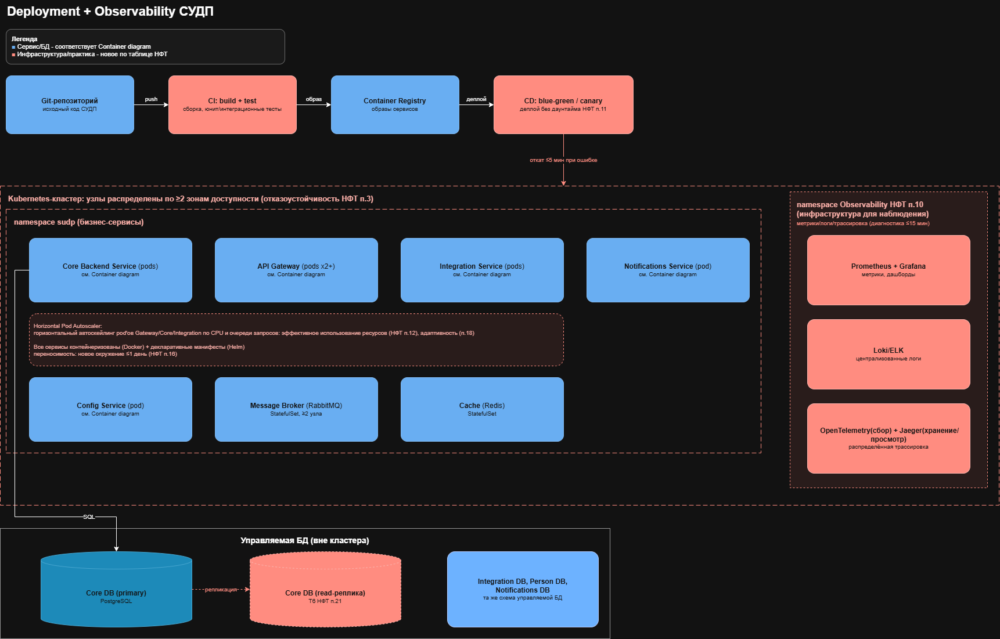

= Внедрение автоматизации при добавлении новых продуктов в сети закусочных «Замысловатость»
:toc: macro
:toclevels: 3
:sectnums:
:sectnumlevels: 3

toc::[]

Структура репозитория:

....
README.adoc - этот документ (вся содержательная часть)
diagrams/ - экспортированные PNG всех диаграмм архитектуры
diagrams/sources/ - исходники диаграмм (.puml, .drawio, .svg)
roadmap/ - диаграмма Ганта проекта
....

[#_термины_и_сокращения]
== Термины и сокращения

[cols="1,3", options="header"]
|===
| Термин | Расшифровка

| СУДП | Система управления добавлением продуктов - целевая система проекта
| НФТ | Нефункциональные требования (надежность, безопасность, производительность и т.д.)
| ATAM | Architecture Tradeoff Analysis Method - метод анализа архитектурных компромиссов
| ENISA IAF | ENISA Information Assurance Framework - фреймворк оценки уверенности в информационной безопасности
| C4 | Модель документирования архитектуры уровнями Context/Container/Component/Code
| EDA | Event-Driven Architecture - событийно-ориентированная архитектура
| SOA | Service-Oriented Architecture - сервисно-ориентированная архитектура
| SLA | Service Level Agreement - соглашение об уровне обслуживания
| RTO / RPO | Recovery Time Objective / Recovery Point Objective - допустимое время простоя и допустимая точка потери данных при сбое
| SSO | Single Sign-On - единый вход (одна аутентификация для всех систем)
| OAuth 2.0 / OIDC | Протоколы авторизации и аутентификации, на которых построен SSO
| RBAC | Role-Based Access Control - управление доступом на основе ролей
| DTO | Data Transfer Object - объект передачи данных между слоями/по API
| JPA | Java Persistence API - механизм доступа к БД из Java-кода
| CI/CD | Continuous Integration / Continuous Delivery - непрерывная интеграция и поставка
| MVP | Minimum Viable Product - минимально жизнеспособный продукт (первая версия системы)
| HPA | Horizontal Pod Autoscaler - механизм Kubernetes для автомасштабирования сервисов
| R-xx | Идентификатор риска в проектном реестре рисков (R-01…R-23), оценка «вероятность × влияние»
| AR-x | Идентификатор архитектурного риска, выявленного на ATAM-сессии (AR-1…AR-5)
| SC-xx | Идентификатор сценария качества в дереве полезности ATAM (SC-01…SC-10)
|===

[#_общая_информация]
== Общая информация

При добавлении нового продукта (блюда) в сети закусочных «Замысловатость» выделяется ряд проблем:

* длительный процесс - вывод нового блюда занимает больше месяца, за это время конкуренты успевают вывести 6-7 новых продуктов;
* потеря артефактов - рецептуры, требования и статусы передаются между отделами вручную (бумага, фото с планшета, личные договоренности) и теряются;
* разная коммуникация между отделами - единого канала нет: кому-то технолог пишет на email, с кем-то заводит чат в мессенджере, кому-то передает распечатку, для ИТ-отделов заводит отдельные таски в баг-трекере;
* перегрузка технолога - именно технолог вручную координирует все 13+ отделов и систем, вовлеченных в процесс.

Поэтому необходима автоматизация процесса внедрения новых продуктов. Целевая система *СУДП (Система управления добавлением продуктов)* должна принимать описание нового продукта, распределять задачи по всем участвующим отделам и системам, отслеживать их выполнение и статус в реальном времени.

[#_цели_внедрения_проекта]
== Цели внедрения проекта

Бизнес-цель, от которой считаются все остальные показатели: сократить цикл вывода нового блюда в продажу с текущих 30+ дней до *5 рабочих дней* (предельно допустимо 7). Цель зафиксирована как целевой показатель на ATAM-сессии (см. <<_atam_сессия_и_приоритизация_нфт>>) и является точкой отсчета для всех приоритетов НФТ.

Производные цели:

. Устранить потерю артефактов - все данные о новом продукте и статусах задач хранятся в одной системе, а не в почте, чатах и на бумаге.
. Дать всем отделам единый канал постановки и отслеживания задач вместо разрозненных каналов коммуникации.
. Снизить нагрузку на технолога - маршрутизацию задач по отделам и системам берет на себя workflow-движок СУДП, а не один человек вручную.
. Обеспечить интеграцию с существующим ИТ-контуром (13+ систем) без переписывания уже работающих систем - через адаптеры и единый событийный канал.
. Дать бизнесу измеримые гарантии качества сервиса при переходе на новую систему: доступность на пути публикации, защиту рецептур и себестоимости от несанкционированного доступа, устойчивость к росту сети.

[#_описание_проекта_и_основных_решаемых_задач]
== Описание проекта и основных решаемых задач

=== Текущий процесс (as-is)

Сейчас процесс идет вручную и без единой системы: маркетолог собирает ожидания клиентов → подключает технолога → технолог согласовывает рецептуру с шеф-поваром (передается фото с планшета или на бумаге) → описывает продукт в Google Doc и рассылает по 10+ отделам, каждому своим каналом (email, чат в мессенджере, бумага, отдельные таски в баг-трекере для ИТ) → ответы отделов возвращаются к технологу вручную, каждый своим каналом → он передает все бизнес-аналитику → тот уточняет требования и ставит задачу системному аналитику → системный аналитик декомпозирует ее на эпики по ИТ-отделам. Отсюда и проблемы из <<_общая_информация>>: длинная цепочка ручных передач и ни одной точки, где виден статус процесса целиком.

=== Целевой процесс (to-be)

СУДП становится центральным узлом процесса: маркетолог инициирует запуск → шеф-повар вносит рецептуру и техкарты → технолог ведет продукт по настраиваемому workflow → система сама создает и назначает задачи каждому вовлеченному отделу, отслеживает их статус и после готовности публикует продукт во все потребляющие системы одним событием.

Существующие системы, которые затрагиваются при добавлении нового продукта:

[cols="1,3", options="header"]
|===
| Система | Что должно измениться при добавлении продукта

| Сайты и мобильные приложения | Продукт появляется в меню, доступен к заказу онлайн
| Терминалы самообслуживания | Продукт добавляется в список блюд на терминале
| Система управления заказами | Продукт становится доступен для приема и обработки заказов
| Система управления производством | Обновляются мониторы/терминалы кухни для отслеживания приготовления нового блюда
| Система управления складом | Заводятся ингредиенты, включается авто заказ недостающих позиций
| Система управления логистикой | Настраивается отслеживание поставок ингредиентов и сроков годности
| Система управления персоналом | Обновляется график и запускается обучение персонала приготовлению
| Система управления клиентским опытом | Продукт попадает в материалы для соцсетей и каналов коммуникации
| Платежные системы | Продукт становится доступен к оплате во всех способах оплаты
| Аналитика данных | Начинается сбор данных по продажам и реакции клиентов на новый продукт
| Конвейеры и роботы | При необходимости перенастраивается автоматика кухни
| Службы доставки (UberUniverse Eats, DeliverWorld) | Продукт публикуется во внешних каналах доставки
| Маркетинговые решения | Продукт подключается к программам лояльности и рекламным кампаниям
|===

[#_ит_методология]
=== ИТ-методология

Для разработки и внедрения выбраны две разные методологии:

* *Scrum* (спринты по 2 недели) - для разработки самой системы СУДП. Требования на старте не полны, вовлечено много отделов и систем со своими зависимостями, поэтому нужна гибкость к появлению и изменению требований в процессе.
* *Kanban* - для внедрения системы в отделах. Задачи внедрения не привязаны к спринтам, а требуют непрерывного наглядного отслеживания потока.

Церемонии и их обоснование:

[cols="1,2,4", options="header"]
|===
| Методология | Церемония | Зачем

| Scrum | Дейлик (15-30 мин/день) | Видно, на какой стадии проект и какие есть блокеры, помогает направить тех, кто не понимает, с чего начать задачу
| Scrum | Планирование спринта (2 ч, начало спринта) | Фиксирует, кто какой задачей занимается в течение спринта
| Scrum | Груминг (отдельно от планирования, по необходимости) | Проводится, если объем задач выходит за рамки текущего спринта (обсудить приоритет до планирования), в требованиях есть недопонимание в команде (дополнить задачи недостающей информацией и определить критерии готовности), требования слишком обширны (декомпозировать задачи)
| Scrum | Демо (1 ч, конец спринта) | Проверка, что сделано корректно и можно катить в прод
| Scrum | Ретро (30-60 мин, конец спринта) | Разбор спринта: что усилить, что улучшить
| Kanban | Дейлик + осмотр доски (15-30 мин/день) | Тот же смысл, что в Scrum, применительно к задачам внедрения
| Kanban | Пополнение очереди (1 ч/неделю) | Определение, какие задачи внедрения берутся в работу дальше
| Kanban | Встреча с заказчиком (30 мин/2 недели) | Сверка, что двигаемся в верном направлении, актуализация сроков
|===

*Правила ретро:*

* не критиковать участников команды;
* сохранять дружелюбную обстановку;
* быть честным, если накосячил, сознайся, ничего страшного в этом нет;
* жесткий тайм-бокс;
* голос каждого участника значим независимо от должности;
* решения, принятые на ретро, обязательно реализуются в следующих спринтах, а не уходят «в стол»;
* участники заранее готовят тезисы понравилось/не понравилось за спринт, чтобы выделить конкретные вопросы для обсуждения.

*Правило для Kanban-доски против зависших задач:* 

* если задача ушла в просрочку, дается запас в 2 дня, после чего она переносится в отдельную колонку «проблемных», по ней проводится разбор с ответственным, фиксируется новый срок исполнения и статус проверяется ежедневно.

=== Управление проектом

Проект ведется в Jira: работа разбита на 5 эпиков (см. <<roadmap>>), каждая задача это отдельный тикет с исполнителем.

[#roadmap]
== Roadmap проекта (диаграмма Ганта)

Плановый срок реализации - 18 сентября 2026, с буфером в 3 недели на непредвиденные обстоятельства - предельный срок *9 октября 2026*.

[cols="1,2,3", options="header"]
|===
| Эпик | Период | Содержание

| SUDP-4. Анализ требований | Апрель - начало мая | Сбор информации о текущем процессе, документирование бизнес-флоу, согласование бюджета/трудозатрат (БФТ) с отделами
| SUDP-7. Техническое проектирование | Май - июль | Разработка архитектуры (C4, ATAM-сессия - см. <<_описание_архитектуры_проекта_с_нфт>>), проектирование интеграций, UI/UX, постановка и согласование техзадания на разработку
| SUDP-8. Разработка | Июнь - июль | Разработка бэкенда и фронтенда СУДП (два цикла: MVP и доработка)
| SUDP-9. Тестирование | Июнь - сентябрь | Написание тест-кейсов, функциональное, интеграционное, UI/UX, регрессионное и приемочное тестирование
| SUDP-10. Внедрение | Август - сентябрь | Подготовка инфраструктуры, выкатка на тестовый стенд, обучение пользователей, выкатка на предпрод и прод
|===

[#_команда_проекта]
== Команда проекта

[cols="2,1", options="header"]
|===
| Роль | Количество

| Системные аналитики | 3
| Бизнес-аналитики | 1
| Архитекторы | 1
| Разработчики | 5
| Тестировщики | 3
| DevOps | 1
| Дизайнеры | 1
| *Итого* | *15*
|===

Команда разработки работает по Scrum (двухнедельные спринты), команда внедрения по Kanban (см. <<_ит_методология>>).

[#_риски_проекта]
== Риски проекта

Оценка рисков проведена по классической матрице «вероятность × влияние» (шкала 1-5, оценка независимо для каждого риска), балл = вероятность × влияние.

Легенда: 🟩 низкий риск (общий балл ≤ 6) 🟧 средний риск (общий балл 8-9) 🟥 высокий риск (общий балл ≥ 12).

Каждому риску присвоен сквозной идентификатор *R-01…R-23*. Ссылки вида `R-xx` в остальных разделах документа и в презентации указывают на строки этого реестра. Архитектурные риски, выявленные на ATAM-сессии, имеют собственную нумерацию *AR-1…AR-5* (см. <<_atam_сессия_и_приоритизация_нфт>>) - они относятся к архитектуре решения, а не к ходу проекта, и связаны с реестром через таблицу прослеживаемости.

[#_реестр_рисков]
=== Реестр рисков

[cols="1,5,2,1", options="header"]
|===
| ID | Риск | Вероятность × влияние | Балл

| R-01 | Интеграция с 13+ внешними системами | 5 × 4 | 🟥 20
| R-02 | Несовместимость систем и форматов данных | 4 × 4 | 🟥 16
| R-03 | Недоверие пользователей к системе | 4 × 4 | 🟥 16
| R-04 | Изменение требований в процессе | 5 × 3 | 🟥 15
| R-05 | Ошибки в коде и баги в приложениях | 4 × 3 | 🟥 12
| R-06 | Модификация существующих систем под интеграцию | 3 × 3 | 🟧 9
| R-07 | Технические ограничения и несовместимость компонентов | 3 × 3 | 🟧 9
| R-08 | Зависимость от внешних поставщиков и контрагентов | 3 × 3 | 🟧 9
| R-09 | Ошибки и сбои при настройке и интеграции систем | 3 × 3 | 🟧 9
| R-10 | Обмен информацией между базами данных | 3 × 3 | 🟧 9
| R-11 | Интеграция систем на разных платформах и архитектурах | 3 × 3 | 🟧 9
| R-12 | Неполное соответствие требованиям пользователей | 3 × 3 | 🟧 9
| R-13 | Отказ и сбои серверов и сетевого оборудования | 2 × 4 | 🟧 8
| R-14 | Недостаточное тестирование и отладка | 2 × 4 | 🟧 8
| R-15 | Излишне оптимистичная оценка сроков | 4 × 2 | 🟧 8
| R-16 | Сложности адаптации пользователей к интерфейсу | 4 × 2 | 🟧 8
| R-17 | Неудовлетворительная производительность и масштабируемость | 2 × 3 | 🟩 6
| R-18 | Непредвиденные технические сбои | 3 × 2 | 🟩 6
| R-19 | Отсутствие части функций в продукте | 2 × 3 | 🟩 6
| R-20 | Ошибки в оценке бюджета проекта | 3 × 2 | 🟩 6
| R-21 | Сложности совместной работы разных приложений | 2 × 2 | 🟩 4
| R-22 | Проблемы совместимости версий ПО | 2 × 1 | 🟩 2
| R-23 | Проблемы удобства и эргономики интерфейса | 2 × 1 | 🟩 2
|===

Исходная оценка (выгрузка таблицы с баллами):

=== Риски высокого уровня (детальный разбор)

[cols="3,4,4", options="header"]
|===
| Риск (балл) | Источник и последствие | Барьер (предотвращение) и мера восстановления

| *R-01. Интеграция с 13+ внешними системами* (5×4=20)
| Источник: 13+ систем (мобилка, сайты, терминалы, ERP, WMS, логистика, платежки, роботы, доставки), у каждой свой API, формат данных, протокол. Последствие: остановка процесса добавления продукта, рассинхрон данных, потеря выручки
| Барьер: API Gateway как единая точка входа, SLA с владельцами систем, контракты API в OpenAPI/Swagger, пилотная интеграция с 2-3 системами до полномасштабной разработки. Восстановление: временный ручной ввод через админ-панели, приоритетное восстановление критичных интеграций (заказы → производство → склад), уведомление смежных отделов

| *R-02. Несовместимость систем и форматов данных* (4×4=16)
| Источник: разные платформы, версии протоколов, форматы дат, кодировки, единицы измерения. Последствие: частичная потеря данных, некорректные заказы, срыв сроков интеграции
| Барьер: единый словарь данных (Data Dictionary) и схема трансформации на этапе проектирования, промежуточный формат (JSON Schema/Protobuf) с валидацией, автотесты совместимости. Восстановление: конвертеры данных на лету с логированием ошибок, ручная корректировка через админ-интерфейс при критичных случаях, доработка интерфейсов по договоренности с владельцами систем

| *R-03. Недоверие пользователей к системе* (4×4=16)
| Источник: отделы привыкли к личным договоренностям, бумаге, гугл-документам. Последствие: сотрудники продолжают ручной обход системы, неполные данные, отказ от системы в целом
| Барьер: раннее вовлечение ключевых пользователей в проектирование и демо прототипов, обучение в формате тренажеров с поддержкой, помощники в каждом отделе. Восстановление: прямая коммуникация от руководителя проекта, служба поддержки, персональный коучинг сопротивляющихся сотрудников

| *R-04. Изменение требований в процессе* (5×3=15)
| Источник: маркетинг/отделы могут менять запросы по ходу разработки. Последствие: рост сроков и бюджета, недовольство команды постоянными изменениями
| Барьер: короткие спринты (2 недели) с регулярными демо заказчику, изменения только через Product Owner с переприоритизацией, груминг перед каждым спринтом. Восстановление: остановка спринта в экстренных случаях и старт нового с измененными требованиями, отказ от наименее ценных задач ради сроков, пересмотр даты релиза

| *R-05. Ошибки в коде и баги в приложениях* (4×3=12)
| Источник: сложная логика маршрутизации задач между отделами, много сценариев обработки статусов, интеграционные вызовы. Последствие: сбои процесса добавления продукта, потеря данных, задержка релиза
| Барьер: code review каждой задачи, модульное и интеграционное тестирование, feature-флаги. Восстановление: откат на предыдущую стабильную версию, hotfix, уведомление ответственных отделов об ограничениях
|===

=== Риски среднего и низкого уровня

Балл 8-9 (🟧 средний): R-06 модификация существующих систем для интеграции; R-07 технические ограничения и несовместимость компонентов; R-08 зависимость от внешних поставщиков и контрагентов; R-09 ошибки и сбои при настройке и интеграции систем; R-10 обмен информацией между базами данных; R-11 интеграция систем на разных платформах и архитектурах; R-12 неполное соответствие требованиям пользователей; R-13 отказ и сбои серверов и сетевого оборудования; R-14 недостаточное тестирование и отладка; R-15 излишне оптимистичная оценка сроков; R-16 сложности адаптации пользователей к новому интерфейсу.

Балл ≤ 6 (🟩 низкий): R-17 неудовлетворительная производительность/масштабируемость; R-18 непредвиденные технические сбои; R-19 отсутствие части функций в продукте; R-20 ошибки оценки бюджета; R-21 сложности совместной работы разных приложений; R-22 проблемы совместимости версий ПО; R-23 проблемы удобства и эргономики интерфейса.

Полные оценки по каждому риску - в <<_реестр_рисков>> и на выгрузке `diagrams/risk-matrix.png` выше.

[#_описание_выбранного_решения_общие_сведения]
== Описание выбранного решения (общие сведения)

СУДП спроектирована как *событийно-ориентированная (EDA) система с элементами SOA*: ядро (Core Backend Service) ведет жизненный цикл продукта и workflow, публикует доменные события в брокер (RabbitMQ), а сервис интеграций (Integration Service) асинхронно подписывается на события и через набор адаптеров рассылает данные о продукте по всем внешним системам сети «Замысловатость» и внешним партнерам по доставке.

Ключевые архитектурные решения и их обоснование (компромиссы разобраны на ATAM-сессии, подробнее <<_atam_сессия_и_приоритизация_нфт>>):

[cols="2,3", options="header"]
|===
| Решение | Почему

| Асинхронная публикация через брокер сообщений (RabbitMQ), а не синхронные вызовы | Потеря данных дороже задержки в минуты: недошедшее до склада блюдо останавливает производство. Целевые 5 минут публикации достижимы и асинхронно
| Адаптер на каждую внешнюю систему вместо универсального интегратора | Поддержка 13+ адаптеров дешевле, чем регрессия всех интеграций при изменении одной чужой системы, издержки снижены каноническим форматом данных и контрактами OpenAPI
| Eventual consistency с окном ≤ 5 минут + запрет публикации в клиентские каналы до подтверждения от склада и заказов | Исключает ситуацию «клиент заказал блюдо, которого нет на складе», не жертвуя скоростью
| Единая точка входа API Gateway с SSO через Keycloak (OAuth 2.0 + OIDC) | Централизует контроль доступа при сохранении удобства (однократный вход), ограничения только на чувствительные поля (рецептура, себестоимость), а не на весь интерфейс
| Модели данных разделены по слоям (DTO/доменная модель/JPA), конфигурируемый workflow со второй итерации | То, что дорого переделать (модели данных), делается правильно сразу, то, что можно добавить позже (гибкость workflow), не удорожает первую поставку
| Единая БД в MVP с планом на реплики чтения при росте нагрузки | Скорость разработки важнее в MVP, путь к масштабированию заложен архитектурно, а не постфактум
|===

Стек технологий: мобильные и web-клиенты - Swift/Kotlin, React/TypeScript; ядро и интеграции - Java/Spring (Spring MVC, Spring Data JPA, Spring AMQP); API Gateway - NGINX; аутентификация - Keycloak; брокер событий - RabbitMQ; хранилища - PostgreSQL (Core DB, Integration DB, Person DB, Notifications DB) и Redis (кэш); наблюдаемость - Prometheus/Grafana, Loki/ELK, OpenTelemetry/Jaeger; развертывание - Docker/Kubernetes, CI/CD с blue-green/canary-деплоем.

[#_описание_архитектуры_проекта_с_нфт]
== Описание архитектуры проекта (с НФТ)

=== Контекст системы

СУДП взаимодействует с семью типами пользователей (маркетолог инициирует запуск; шеф-повар создает рецептуру; технолог координирует процесс и управляет workflow; сотрудник отдела - обобщенная роль представителя закупок, логистики, HR, ценообразования, производства, склада, клиентского опыта, маркетинга, аналитики; бизнес-аналитик формирует требования; системный аналитик ставит технические задачи; администратор управляет самой системой) и интегрируется с тремя группами систем сети «Замысловатость» (внутренние системы - склад, закупки, производство, персонал, заказы, логистика, клиентский опыт, безопасность, платежи, аналитика; клиентские приложения - сайты, мобильные приложения, терминалы самообслуживания; конвейеры и роботы кухни), а также с внешними службами доставки (UberUniverse Eats, DeliverWorld). Исходник диаграммы - `diagrams/sources/c4-context.puml` (PlantUML/C4).

[#_atam_сессия_и_приоритизация_нфт]
=== ATAM-сессия и приоритизация НФТ

Перед проектированием контейнеров и компонентов проведена ATAM-сессия (Architecture Tradeoff Analysis Method) - двухдневная (Ф1 - узкий круг: команда оценки, архитектор, спонсор, аналитики, разработка; Ф2 - расширенный состав: плюс владельцы смежных систем, пользователи, эксплуатация, ИБ), с независимой командой оценки, не участвующей в разработке СУДП, чтобы избежать конфликта интересов.

*Веса атрибутов качества*, полученные голосованием четырех групп стейкхолдеров (бизнес, владельцы систем, разработка, эксплуатация) относительно бизнес-драйвера «5 дней вместо месяца»:

[cols="3,1,4", options="header"]
|===
| Атрибут качества | Вес | Целевой показатель

| Интегрируемость | 20% | Подключение новой системы ≤ 5 чел-дней; изменение чужого API не затрагивает ядро
| Надежность | 18% | Потеря подтвержденных событий = 0 (RPO = 0); RTO ≤ 5 мин; доступность 99,9% на пути публикации
| Производительность | 15% | Сквозная публикация ≤ 5 мин (95-й перцентиль) при 10 параллельных публикациях
| Удобство использования | 14% | Новая задача выполняется за ≤ 10 мин без обучения (≥ 80% в юзабилити-тесте)
| Безопасность | 13% | Ролевой доступ к чувствительным полям; 100% попыток нарушения в аудите
| Масштабируемость | 10% | Рост сети до 100 точек, х3 запусков; деградация отклика ≤ 20%
| Модифицируемость | 10% | Новый этап workflow ≤ 2 дней (со 2-й итерации), без изменения кода
|===

Дерево полезности, связывающее атрибуты со сценариями:

Сценарии качества пронумерованы сквозным образом *SC-01…SC-10* (см. дерево выше). Приоритет сценария считается по формуле:

....
приоритет = вес атрибута качества (%) × архитектурный риск сценария (1-5)
....

Пять сценариев с наибольшим архитектурным риском (риск ≥ 4 из 5) ушли в углубленный разбор:

[cols="1,4,2,1", options="header"]
|===
| ID | Сценарий | Расчет приоритета | Приоритет

| SC-02 | Устойчивость к смене версии внешнего API | 20% × 4 | 80
| SC-05 | Сквозная публикация ≤ 5 мин | 15% × 5 | 75
| SC-03 | Гарантия доставки события | 18% × 4 | 72
| SC-10 | Новый этап workflow без изменения кода | 10% × 5 | 50
| SC-09 | Рост сети до 100 точек | 10% × 4 | 40
|===

По итогам сессии приняты компромиссы T1-T7 (асинхронная публикация вместо синхронной, адаптеры вместо универсального интегратора, eventual consistency с ограничением окна, SSO с точечными ограничениями, порядок реализации моделей/workflow, единая БД в MVP, кластеризация API Gateway раскрыты в <<_описание_выбранного_решения_общие_сведения>>) и зафиксированы пять архитектурных рисков *AR-1…AR-5*.

[#_прослеживаемость_рисков]
==== Прослеживаемость: архитектурный риск → сценарий → реестр

Таблица связывает три нумерации: архитектурные риски ATAM (AR-x), сценарии качества (SC-xx) и строки проектного реестра рисков (R-xx из <<_реестр_рисков>>).

[cols="1,3,2,1,4", options="header"]
|===
| ID | Архитектурный риск ATAM | Сценарий качества | Реестр | Митигация

| AR-1 | Единая точка отказа на API Gateway | SC-04 | R-13 (8) | Кластеризация ≥ 2 узлов с health-check
| AR-2 | Не зафиксирован SLA с владельцами внутренних систем | SC-01, SC-05 | R-01 (20), R-08 (9) | Согласовать SLA до начала разработки, контракты OpenAPI
| AR-3 | Рассинхрон меню между каналами | SC-05 | R-10 (9) | Блокировка публикации до подтверждений от склада и заказов
| AR-4 | Сопротивление пользователей | SC-06, SC-07 | R-03 (16), R-16 (8) | Раннее вовлечение, обучение, помощники в отделах
| AR-5 | Несовместимость форматов данных | SC-02 | R-02 (16) | Канонический формат, JSON Schema, автотесты
|===

AR-1 не имеет отдельной строки в реестре: реестр составлялся до проектирования архитектуры, а единая точка отказа на API Gateway выявлена уже на ATAM-сессии. Ближайшая по смыслу строка реестра - R-13 «Отказ и сбои серверов и сетевого оборудования».

=== Контейнеры

Пользовательские клиенты (Mobile App, Web App) обращаются через API Gateway (NGINX), который маршрутизирует запросы в Core Backend Service (ядро - ведение продукта, workflow, задач) и Notifications Service (push/websocket-уведомления), а аутентификацию делегирует Identity Providers (Keycloak). Core Backend Service публикует доменные события (`WorkflowStageCompleted`, `ProductReadyForPublishing`, `TaskAssigned`) в Message Broker (RabbitMQ); Integration Service подписывается на них и передает данные во внутренние системы сети, клиентские приложения, конвейеры/роботов и во внешние службы доставки. У каждого контейнера своя БД (Core DB, Integration DB, Person DB, Notifications DB).

=== Компоненты

Внутри *Core Backend Service*: контроллеры (Product/Workflow/Task, Spring MVC) принимают REST-запросы и делегируют сервисам: Product Service ведет жизненный цикл продукта, Workflow Orchestration Service оркестрирует этапы запуска (SOA), Task Service управляет задачами отделов; все они читают/пишут через Core Repository (Spring Data JPA) в Core DB, а Event Publisher публикует события в брокер. Модели разделены по трем слоям как отдельные компоненты: API DTO (объекты передачи данных REST API, использует контроллер), Domain Model (доменные объекты: Product, Workflow, Stage, Task, ReferenceData, использует сервисы) и JPA Entity (сущности хранения, использует репозиторий) - это снижает связанность между слоями.

Внутри *Integration Service*: Event Controller асинхронно принимает события из брокера, Event Service обрабатывает их и через Event Repository сохраняет в Integration DB, затем передает Integration Dispatcher, который маршрутизирует данные по адаптерам (Delivery, ERP, Menu, Kitchen) - каждый адаптер вызывает свою внешнюю систему по REST. Модели здесь так же разделены на Integration DTO (объекты обмена: входящее событие и исходящие запросы к внешним системам, использует контроллер и адаптеры), Domain Model (Product, StatusSend, использует сервис и диспетчер) и JPA Entity (используется репозиторием).

=== Нефункциональные требования

Полный набор из 22 категорий НФТ, требуемых методологией курса. Часть (Блок А) уже разобрана на ATAM через атрибуты качества QA1-QA7 и расширяется под задачу автоматизации; остальные (Блок Б) не входили в сценарии ATAM и закрыты отдельными архитектурными элементами.

*Блок А - покрыто ATAM:*

[cols="3,4", options="header"]
|===
| НФТ | Как обеспечено

| Производительность | Асинхронная публикация ≤ 5 мин (95-й перцентиль), сценарий SC-05
| Надежность | RPO = 0, доставка at-least-once, идемпотентность обработчиков
| Отказоустойчивость | Кластеризация API Gateway (≥ 2 узла), health-check, автопереключение
| Удобство использования | Задача новым сотрудником ≤ 10 мин без обучения
| Масштабируемость системы | Рост сети до 100 точек, деградация отклика ≤ 20%; горизонтальное масштабирование Core/Integration Service
| Модифицируемость | Новый этап workflow ≤ 2 дня, без изменения кода (со 2-й итерации)
| Поддержка интеграции | Адаптеры, канонический формат, контракты OpenAPI
| Совместимость | Новая версия внешнего API затрагивает ровно 1 адаптер, простоя нет
|===

*Блок Б - новые архитектурные элементы:*

[cols="3,4", options="header"]
|===
| НФТ | Архитектурный элемент

| Управляемость | Централизованный config-сервис (Spring Cloud Config), изменение конфигурации без перезапуска
| Мониторинг и отладка | Prometheus+Grafana (метрики), Loki/ELK (логи), OpenTelemetry/Jaeger (трассировка); диагностика инцидента ≤ 15 мин
| Удобство сопровождения и развертывания | CI/CD, blue-green/canary деплой, откат ≤ 5 мин
| Эффективное использование ресурсов | Горизонтальный автоскейлинг (K8s HPA), кэш карточек продукта (Redis)
| Целостность данных | Транзакционность Core DB, идемпотентность, схема-валидация на входе интеграций
| Расширяемость | Strategy/Plugin-паттерн для правил валидации продукта поверх адаптеров
| Модульность | Слоистая структура компонентов (контроллер/сервис/репозиторий/модель), независимый деплой
| Переносимость | Контейнеризация (Docker) + декларативная инфраструктура (Kubernetes/Helm); новое окружение ≤ 1 день
| Межоперабельность | Канонический формат данных + Schema Registry для версионирования событий
| Адаптивность | Автоскейлинг + Circuit Breaker на вызовах адаптеров
| Гибкость | Конфигурируемый workflow (2-я итерация)
| Конфиденциальность и безопасность | См. <<_безопасность_enisa_iaf>>
| Масштабируемость БД | Реплики чтения Core DB при утилизации > 70%
| Масштабируемость сети | Кластеризация RabbitMQ (≥ 2 узла)
|===

=== Архитектура с учетом НФТ (Container overlay)

Поверх исходной контейнерной диаграммы (без изменения уже провалидированных на ATAM решений) добавлены: Load Balancer и кластер API Gateway ≥ 2 узла (отказоустойчивость, устраняет AR-1, реестр R-13), кластер RabbitMQ ≥ 2 узла (масштабируемость сети), Config Service (управляемость), Cache/Redis (эффективное использование ресурсов), read-реплика Core DB (масштабируемость БД, порог 70% утилизации), Schema Registry (расширяемость/межоперабельность событий), Circuit Breaker на вызовах адаптеров (адаптивность - недоступность одного адаптера не блокирует публикацию в остальные системы).

[#_безопасность_enisa_iaf]
=== Безопасность (ENISA IAF)

Из трех рассмотренных фреймворков (ENISA IAF, NIST CSF, ISO/IEC 27001) выбран *ENISA Information Assurance Framework*: у него, в отличие от остальных, есть выделенный домен про доверие к третьим сторонам (Third-Party Assurance), что напрямую закрывает архитектурные риски AR-2 и AR-5 (строки реестра R-01 и R-02), а по своей природе IAF фреймворк оценки уверенности, что ближе к самому ATAM.

[cols="3,4,3", options="header"]
|===
| Домен IAF | Требование к СУДП | Механизм

| Governance | Выделенная ответственность за ИБ, политика доступа к рецептурам утверждена до старта разработки | Роль «Специалист по ИБ» - стейкхолдер ATAM
| Risk Management | Реестр рисков ИБ пересматривается регулярно | Реестр рисков ATAM (AR-1…AR-5) как живой документ
| Legal & Compliance | ПДн и коммерческая тайна (рецептуры, себестоимость) обрабатываются по законодательству | Классификация данных на уровне доменной модели Core DB
| Personnel Security | Доступ по минимальным привилегиям, отзыв при увольнении | RBAC в Keycloak + интеграция с HR-системой
| Physical & Environmental Security | Физическая защита серверов | Наследуется от политики ЦОД сети (вне периметра СУДП)
| Operational Security | Изменения в проде - только контролируемо | CI/CD с обязательным code review, feature-флаги
| Identity & Access Management | Единая аутентификация, ролевой доступ к чувствительным полям | SSO через Keycloak (OAuth 2.0 + OIDC)
| Application Security | Валидация всех входящих API | JSON Schema-валидация в Integration Service, контракты OpenAPI
| Data Security & Encryption | Шифрование рецептур/себестоимости при хранении и передаче | TLS 1.2+ везде, шифрование чувствительных полей в Core DB
| Incident Management & BC | Попытки нарушения доступа логируются и расследуются | Append-only журнал аудита (хранение ≥ 1 года)
| Third-Party Assurance | Партнеры обеспечивают согласованный уровень защиты данных | SLA с владельцами систем (закрывает AR-2, реестр R-01), адаптеры не передают наружу лишние поля
|===

=== Развертывание и observability

Пайплайн Git → CI (сборка, тесты) → Container Registry → CD (blue-green/canary, откат ≤ 5 мин). Kubernetes-кластер с узлами в ≥ 2 зонах доступности, namespace `sudp` - бизнес-сервисы (Core/Gateway/Integration/Notifications с Horizontal Pod Autoscaler, Config Service, RabbitMQ и Redis как StatefulSet), namespace `Observability` - Prometheus+Grafana, Loki/ELK, OpenTelemetry+Jaeger. Все сервисы контейнеризированы (Docker) с декларативными манифестами (Helm). БД управляются вне кластера, для Core DB - primary + read-реплика.

[#_заключение]
== Заключение

Архитектура СУДП спроектирована по трем независимым уровням (Context, Container, Deployment), каждый из которых закрывает свою группу нефункциональных требований, и провалидирована через ATAM-сессию до начала полномасштабной разработки - это позволило заранее увидеть архитектурные компромиссы (T1-T7) и архитектурные риски (AR-1…AR-5), а не находить их постфактум в проде. Ключевые решения: событийная архитектура с брокером сообщений и адаптерный подход к 13+ внешним системам напрямую отвечают на исходную бизнес-проблему проекта: сократить цикл вывода нового блюда с месяца до 5 рабочих дней и перестать терять артефакты между отделами.

Открытые направления, требующие внимания на этапе внедрения (см. <<roadmap>>):

* зафиксировать SLA с владельцами внутренних систем (AR-2, реестр R-01), без этого целевое время публикации не гарантируется;
* устранить единственную точку отказа на API Gateway кластеризацией (AR-1, реестр R-13; отражено на overlay-диаграмме, но требует контроля при развертывании);
* заложить меры против сопротивления пользователей новой системе (AR-4, реестр R-03), обучение и вовлечение отделов до полного перехода на СУДП;
* провести повторную ATAM-сессию после реализации MVP и получения фактических данных нагрузочного тестирования.

При успешном внедрении проекта, у сети «Замысловатость» появится шаблон интеграции для любых будущих систем через тот же событийный канал и адаптерный слой.